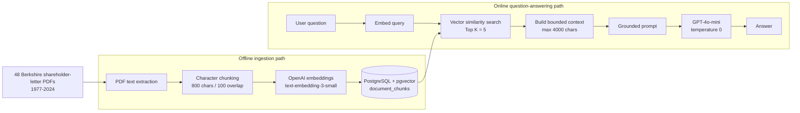
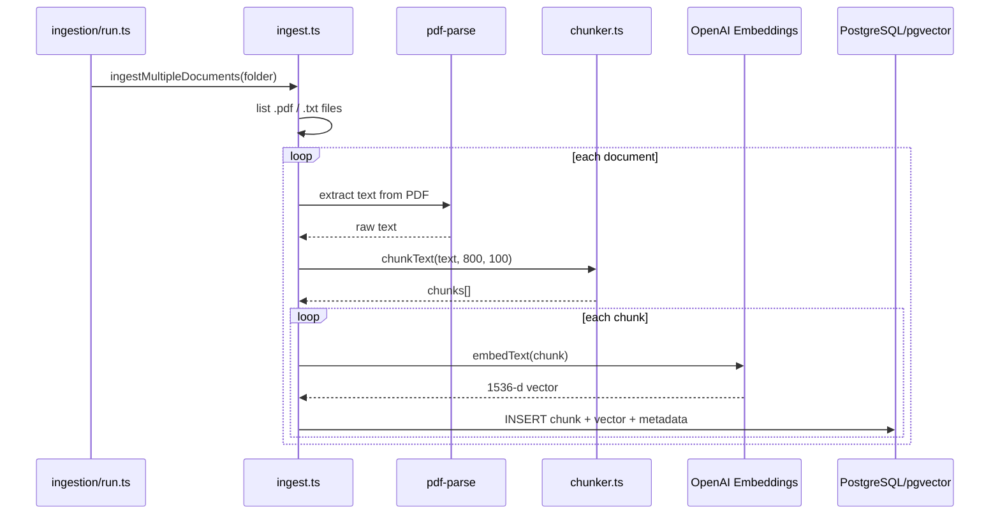
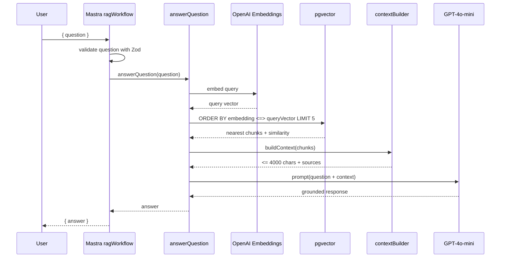

# System Architecture

## 1. Problem being solved

LLMs do not inherently know the exact contents of a private or domain-specific document corpus, and even when a model has general knowledge of Berkshire Hathaway, relying on model memory would make answers difficult to verify.

This project uses **Retrieval-Augmented Generation (RAG)** so the model receives relevant passages from Berkshire Hathaway shareholder letters before answering.

The important design principle is:

> Retrieval supplies the evidence; the LLM converts that evidence into a natural-language answer.

The vector database is therefore part of the model's runtime knowledge path, not merely storage.

---

## 2. High-level architecture



There are two execution paths:

- **Ingestion path:** run ahead of time to populate the vector store.
- **Query path:** run for every user question.

Keeping these separate prevents expensive PDF parsing and document embedding from happening during every user request.

---

## 3. Technology responsibilities

| Technology | Responsibility |
|---|---|
| TypeScript / Node.js | Application implementation |
| `pdf-parse` | Extract text from shareholder-letter PDFs |
| OpenAI `text-embedding-3-small` | Convert chunks and user queries into 1536-dimensional vectors |
| PostgreSQL | Persistent document/chunk metadata and text storage |
| `pgvector` | Vector column and nearest-neighbor similarity operations |
| OpenAI `gpt-4o-mini` | Generate final answers from retrieved context |
| Mastra | Agent/workflow registration and orchestration framework |
| Zod | Typed validation schemas around workflow steps |
| Mastra Memory | Configured on `ragAgent`, although the custom RAG answer path does not currently use that agent memory |

---

## 4. Data model

The vector store is a single table:

```sql
CREATE TABLE IF NOT EXISTS document_chunks (
  id UUID PRIMARY KEY DEFAULT gen_random_uuid(),
  document_id TEXT NOT NULL,
  chunk_index INTEGER NOT NULL,
  content TEXT NOT NULL,
  embedding VECTOR(1536),
  metadata JSONB,
  created_at TIMESTAMP DEFAULT NOW()
);
```

Conceptually:

```text
Document (for example 1998.pdf)
    |
    +-- Chunk 0 -> content + embedding + metadata
    +-- Chunk 1 -> content + embedding + metadata
    +-- Chunk 2 -> content + embedding + metadata
    ...
```

`document_id` is derived from the filename without its extension, so a file such as `1998.pdf` becomes `document_id = "1998"`.

Current metadata stores:

```json
{
  "source": "1998.pdf",
  "ingested_at": "..."
}
```

---

## 5. Ingestion sequence



The script entry point is `src/mastra/ingestion/run.ts`, exposed as:

```bash
npm run ingest
```

---

## 6. Query sequence

The currently connected RAG execution path is:

```text
ragWorkflow
   -> answerQuestion()
      -> prepareRagContext()
         -> retrieveRelevantChunks()
            -> embedQuery()
            -> searchSimilarChunks()
         -> buildContext()
      -> buildPrompt()
      -> generateAnswer()
```



---

## 7. Where Mastra fits

Mastra currently provides a **workflow and agent application shell**.

The `ragWorkflow` has two steps:

```text
Input { question }
     |
     v
validate-question
     |
     v
answer-question
     |
     v
Output { answer }
```

The actual retrieval implementation is not hidden inside Mastra; it lives in your own modules under:

```text
src/mastra/ingestion/
src/mastra/retrieval/
src/mastra/generation/
```

That distinction matters in interviews because it demonstrates that you understand the mechanics of RAG rather than only framework configuration.

---

## 8. Agent vs workflow: current implementation detail

The repository also defines `ragAgent`, a separate Mastra agent using `openai/gpt-4o` and `Memory`.

However, the main custom RAG path does **not** call `ragAgent.generate()`.

Instead:

```text
ragWorkflow
    -> answerQuestion()
        -> generateAnswer()
            -> OpenAI chat.completions (gpt-4o-mini)
```

Meanwhile:

```text
ragAgent
    -> GPT-4o
    -> Mastra Memory
```

exists as a separately registered agent.

`generate.ts` imports `ragAgent`, but that import is unused.

So the current architecture should be described as:

> A custom RAG pipeline wrapped by a Mastra workflow, with a separately configured conversational agent that has not yet been integrated into the retrieval execution path.

This is more accurate than saying “the RAG agent performs retrieval.”
