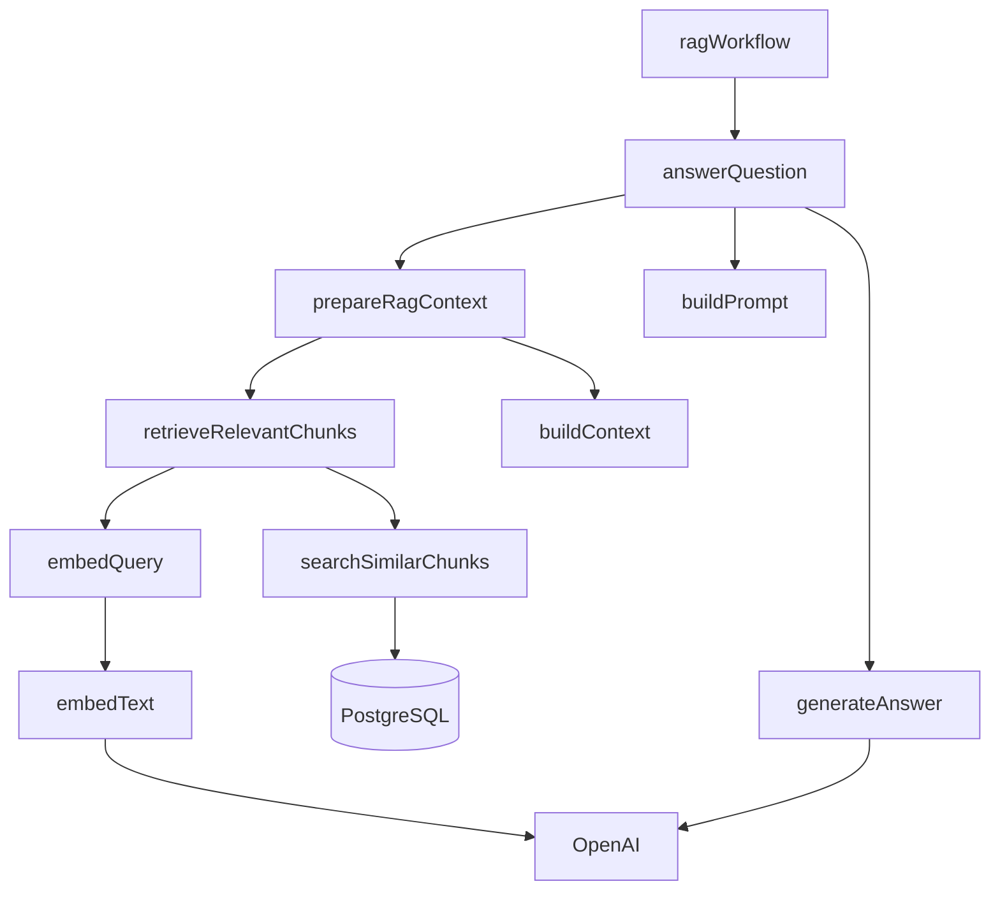

# Codebase Map

This file answers: **“Where is each responsibility implemented?”**

## Directory map

```text
src/mastra/
├── agents/
│   └── ragAgent.ts
├── config/
│   └── env.ts
├── db/
│   ├── client.ts
│   ├── init.ts
│   └── schema.ts
├── generation/
│   ├── answer.ts
│   ├── generate.ts
│   └── prompt.ts
├── ingestion/
│   ├── chunker.ts
│   ├── embeddings.ts
│   ├── ingest.ts
│   └── run.ts
├── retrieval/
│   ├── context.ts
│   ├── contextBuilder.ts
│   ├── noAnswer.ts
│   ├── prepareContext.ts
│   ├── queryEmbedding.ts
│   ├── retrive.ts
│   └── search.ts
├── workflows/
│   └── ragWorkflow.ts
└── index.ts
```

The repository also contains template/demo weather files. They are not part of the Berkshire RAG path.

---

## `config/env.ts`

### Responsibility

Loads environment variables and fails fast if mandatory values are missing.

Required:

```text
OPENAI_API_KEY
DATABASE_URL
```

Defaults:

```text
APP_ENV = local
PORT    = 3000
```

### Engineering significance

Centralized configuration avoids scattering `process.env` reads throughout the codebase and surfaces missing configuration early.

---

## `db/client.ts`

### Responsibility

Creates the PostgreSQL connection pool.

Production SSL behavior:

```ts
ssl: env.APP_ENV === "production"
  ? { rejectUnauthorized: false }
  : false
```

### Interview note

A connection pool is preferable to opening a brand-new database connection for every query because it reuses connections and controls resource usage.

---

## `db/init.ts`

### Responsibility

Initializes pgvector and the application schema.

```text
CREATE EXTENSION IF NOT EXISTS vector
CREATE TABLE IF NOT EXISTS document_chunks ...
```

### Current caveat

The ingestion runner does not call `initDb()` in the current code, so database initialization must happen separately.

---

## `db/schema.ts`

### Responsibility

Defines the chunk table, including:

```text
embedding VECTOR(1536)
metadata  JSONB
```

The 1536 vector width must match the selected embedding model output.

---

# Ingestion layer

## `ingestion/chunker.ts`

Pure function that splits text into overlapping character chunks.

```text
input: document text
output: string[] chunks
```

No database or API concerns are mixed into this module.

---

## `ingestion/embeddings.ts`

Owns the OpenAI client used for embeddings and exposes:

```ts
embedText(text): Promise<number[]>
```

This function is reused for both document chunk embeddings and query embeddings.

---

## `ingestion/ingest.ts`

Main ingestion service.

Responsibilities:

```text
list files
 -> parse PDF/TXT
 -> chunk text
 -> embed each chunk
 -> INSERT into PostgreSQL
```

The function catches errors per document, allowing ingestion to continue to later documents if one file fails.

### Current caveats

- Embeddings are generated sequentially, one chunk at a time.
- There is no batching.
- There is no duplicate/upsert protection.
- Re-running ingestion can insert duplicate chunks.
- No transaction is used around a whole document.

---

## `ingestion/run.ts`

Small command-line entry point for the corpus ingestion process.

Configured folder:

```text
public/Berkshire_Hathaway_Shareholder_Letters
```

---

# Retrieval layer

## `retrieval/queryEmbedding.ts`

Reuses `embedText()` and serializes the resulting vector to pgvector-compatible text:

```text
[0.1,0.2,...]
```

---

## `retrieval/search.ts`

Contains the SQL vector search.

Returns:

```ts
interface RetrievedChunk {
  id: string;
  content: string;
  metadata: any;
  similarity: number;
}
```

Current SQL does not return `document_id` or `chunk_index`, although both are present in the table.

---

## `retrieval/retrive.ts`

Coordinates:

```text
query text
 -> query embedding
 -> vector search
```

Note: the filename is currently spelled `retrive.ts`; a cleanup would rename it to `retrieve.ts`.

---

## `retrieval/context.ts`

Defines the typed `RAGContext` contract:

```ts
interface RAGContext {
  contextText: string;
  sources: string[];
  isEmpty: boolean;
}
```

---

## `retrieval/contextBuilder.ts`

Converts retrieved chunks into LLM-ready context.

Responsibilities:

- enforce the 4000-character context cap,
- attach source labels,
- deduplicate source filenames,
- identify empty context.

---

## `retrieval/prepareContext.ts`

Facade combining:

```text
retrieveRelevantChunks()
        +
buildContext()
```

This keeps the generation layer from needing to know the retrieval internals.

---

## `retrieval/noAnswer.ts`

Defines a refusal helper based on `context.isEmpty`.

Current status: not connected to the production path.

---

# Generation layer

## `generation/prompt.ts`

Builds the grounding prompt.

It contains the most important behavioral constraint:

```text
Answer using ONLY the provided context.
```

---

## `generation/generate.ts`

Direct OpenAI Chat Completions call using:

```text
gpt-4o-mini
temperature = 0
max_tokens = 300
```

`ragAgent` is imported here but unused.

---

## `generation/answer.ts`

The high-level RAG use case:

```text
question
 -> prepare context
 -> refuse if empty
 -> build prompt
 -> generate answer
```

If you need one function to explain as the application's RAG service boundary, this is it.

---

# Orchestration layer

## `workflows/ragWorkflow.ts`

Mastra workflow with Zod contracts.

```text
validate-question
      ->
answer-question
```

The answer step delegates to `answerQuestion()` rather than embedding retrieval logic directly in the workflow.

That is a good separation: orchestration controls sequence, while domain modules contain business logic.

---

## `agents/ragAgent.ts`

Defines a conversational Mastra agent:

```text
model: openai/gpt-4o
memory: new Memory()
```

Its instructions describe Buffett/Berkshire document grounding and source-aware responses.

### Important current-state note

This agent is registered but **not integrated with the custom retrieval pipeline**. Its presence should not be confused with the `gpt-4o-mini` call inside `generation/generate.ts`.

---

## `index.ts`

Composition root for the Mastra application.

Registers:

```text
workflows: ragWorkflow
agents:    ragAgent
storage:   in-memory LibSQL store
logger:    Pino
```

The LibSQL storage URL is `:memory:`, so Mastra internal state is not durable across application restarts.

---

# Dependency direction

A simplified dependency graph is:



The main architectural benefit is that retrieval, context construction, prompting, and generation can be changed independently.
